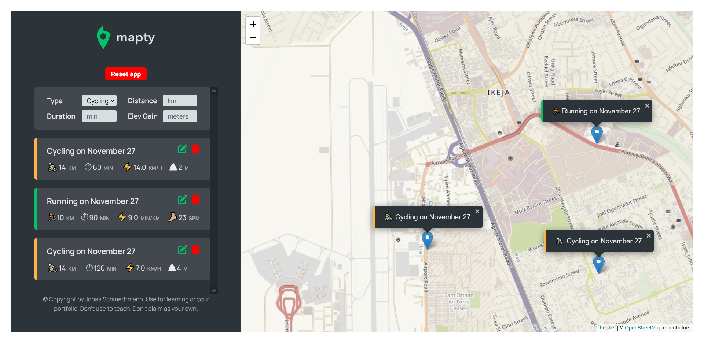
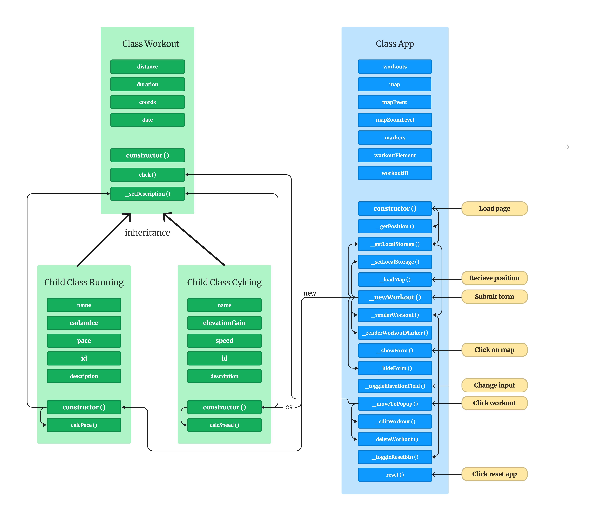

# Jonas Schmedtmann's JS course project - Mapty

This project is aimed at improving my JavaScript coding skills. Please note that this project is designed as a desktop application. For the best experience, I recommend accessing it on a desktop or laptop device.

## Table of contents

- [Jonas Schmedtmann's JS course project - Mapty](#jonas-schmedtmanns-js-course-project---mapty)
  - [Table of contents](#table-of-contents)
  - [Overview](#overview)
    - [The challenge](#the-challenge)
    - [Screenshot](#screenshot)
    - [Links](#links)
  - [My process](#my-process)
    - [Built with](#built-with)
    - [Extra features(challenges) added:](#extra-featureschallenges-added)
    - [What I learned](#what-i-learned)
    - [App Architecture](#app-architecture)
  - [Author](#author)

## Overview

### The challenge

Users should be able to:

- Choose any point on the map and choose between running or cycling. In order to submit the workout, the user needs to fill out several details like distance, duration, cadence or elevation. All the workout will be saved after choosing any new workout option.
- Find the workout on the map by clicking on the list. The list contains workout details like pace, cadence, duration, speed as well as the date of the workout. If the user reloads the page, all the data will be saved.

### Screenshot

### Links

- Solution URL: [solution URL](https://github.com/SoloLere/Mapty.git)
- Live Site URL: [live site URL](https://sololere.github.io/Mapty/)

## My process

### Built with

- HTML
- CSS
- Vanilla JavaScript
- Leaflet API

### Extra features(challenges) added:

- Ability to delete all Workouts
- Ability to delete a workout
- Ability to edit a workout

### What I learned

- Local storage is blocking, so its not advisable to use it to store large data
- JSON.strigify - converts to obj to string
- JSON.parse - converts the string to obj, but I'll loose my prototype chain
- location.reload - reloads a page

### App Architecture

## Author

- Mail - [Oseni Solomon](jnrolalere@gmail.com)
- Frontend Mentor - [Oseni Solomon](https://www.frontendmentor.io/profile/@SoloLere)
- LinkedIn - [Oseni Solomon](https://www.linkedin.com/in/solomon-oseni-b00aa1154)
